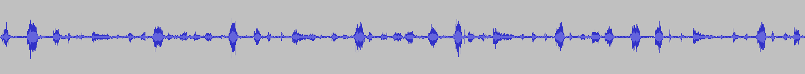
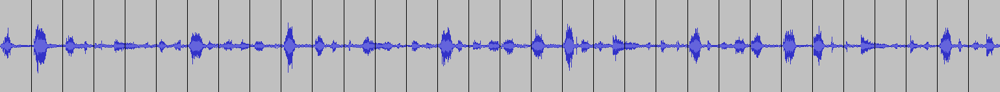

# Rhythm guidelines
A very simple python script for putting equally spaced bars over an image.

# Requirements
You will need the following python packages for this script.
```
pyton -m pip install -U matplotlib
```

# Usage
```
python create_guidelines.py <input_filename> <number_of_bars>
```

# Example
Here is the input and output respectively after running the following.
```
python create_guidelines.py sample.png 32 
```



